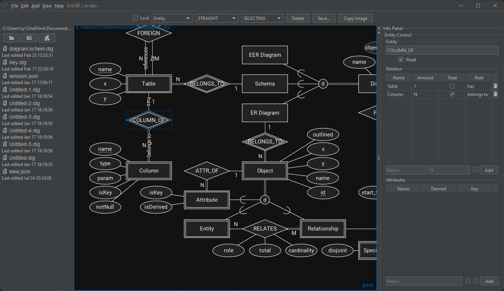

## <ruby>ER Diagram<rt>entity relationship diagrams</rt></ruby> Editor

### Why

Made by [octo-kumo](https://github.com/octo-kumo) since there exists little to none pre-existing, dedicated, easy-to-use
and free programs to draw ER diagrams in **Chen Notation**.

### Wiki

Visit the wiki for more information! (not done at all)

### Issues and bugs

Report it via the "Issue" tab.

### Requirements

Java 8 or higher `>=52`

